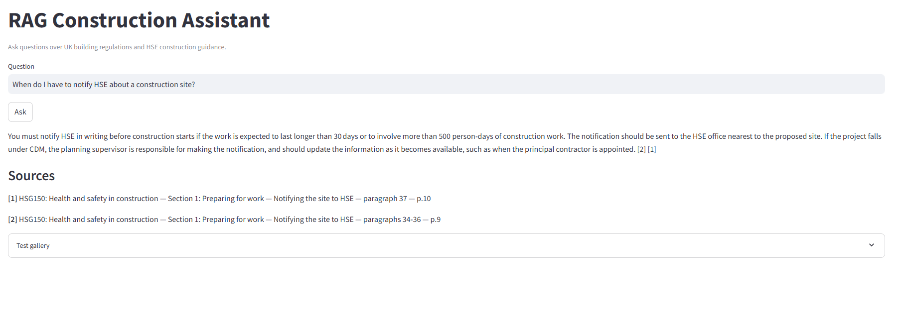

# RAG Construction Assistant

A retrieval-augmented generation assistant for **UK construction safety and building regulations**. Ask a site or dwelling question in plain English; the app retrieves from three official PDFs and answers only from those passages, with IEEE-style `[n]` citations.

Corpus:

- The Merged Approved Documents (Oct 2024)
- HSG141 — Electrical safety on construction sites
- HSG150 — Health and safety in construction

## Problem

Construction questions sit across **regulations** (Approved Documents) and **HSE guidance** (HSG141 / HSG150). Ctrl+F on a 3,000-page merge does not tell you which paragraph applies, and a generic LLM will invent clause numbers. This project retrieves the right chunks first, then generates an answer that can only cite what was retrieved. If the corpus does not cover the question, the model should say so.

## Demo

Live app: [priscilla-buildregs-assistant.streamlit.app](https://priscilla-buildregs-assistant.streamlit.app/)



The demo has a question box, cited-only sources, and a **test gallery** of labeled eval questions (including ones the documents should not answer).

## Tech stack

| Layer | Choice |
|---|---|
| Ingestion | pdfplumber |
| Chunking | Per-document strategies (clauses vs numbered paragraphs) |
| Embeddings | `BAAI/bge-small-en-v1.5` (384-d) |
| Vector store | Chroma (cosine, local) |
| Keyword search | BM25 (`rank-bm25`) |
| Fusion | Reciprocal rank fusion (0.7 vector / 0.3 BM25), then max 3 chunks per PDF |
| Generation | Groq `openai/gpt-oss-20b` |
| App | Streamlit |
| Eval | 25-question set, recall@k on source + paragraph/clause |

## Setup

```powershell
python -m venv .venv
.\.venv\Scripts\Activate.ps1
python -m pip install --upgrade pip
python -m pip install -r requirements.txt
```

Add your Groq key to `.env`. Put the original PDFs in `data/raw/` (gitignored), then build the index:

```powershell
python scripts/run_ingestion.py
python scripts/run_chunking.py
python scripts/run_embedding.py
```

Re-run embedding after any chunking change. The vector store is rebuilt from scratch and tagged with the model name; querying with a different model raises `ModelMismatchError`.

## Usage

```powershell
streamlit run app.py
```

### Streamlit Cloud

`runtime.txt` pins **Python 3.12** (3.14 has no wheels for these packages). In the Cloud app also set Python 3.12 under **Settings**.

1. Push `data/chunks.jsonl` and `data/chroma_db/` (about 80 MB). Do **not** push `data/raw/` PDFs.
2. App settings → **Secrets**. Paste **only** this (replace with your real key), save, reboot:

```toml
GROQ_API_KEY = "gsk_your_key_here"
```

Do not paste the key on its own. Quotes are required.

3. Main file: `app.py`. First load downloads the BGE embedding model and can take a few minutes.

Or from the terminal:

```powershell
python scripts/cli.py "How high should scaffold guard rails be?"
python scripts/cli.py --debug "How high should scaffold guard rails be?"
python scripts/cli.py --file scripts/batch_questions.txt
python -m pytest tests
```

## Results

Retrieval is scored on `eval/eval_set.json` (20 labeled questions + 5 unlabeled negatives that are excluded from the mean). Gold is **source PDF + paragraph/clause**, not chunk id.

Shipped config: hybrid RRF, **k = 5**, **max 3 chunks per PDF**.

| Retriever | Recall@5 | Full hits (of 20) | Recall@10 |
|---|---|---|---|
| Global hybrid (no cap) | 0.800 | 16 | 0.875 |
| Per-source hybrid (dropped) | 0.750 | 14 | 0.900 |
| **Max 3 per PDF (shipped)** | **0.900** | **18** | 0.925 |

k = 5 is the live default: k = 10 does not add full hits, and with the cap it stuffs weakly related PDFs into every prompt.

The remaining two misses are **right PDF, wrong paragraph** (buried-cable paras 21–22; scaffold paras 148–151), not a missing-document problem.

```powershell
python scripts/run_eval.py --k 5 --output eval/results-k5.json
```

## Design decisions

**Per-document chunking, not one splitter for all three PDFs.** Approved Documents are cited by clause (`3.24`, Part A's `2D1`); HSG141/HSG150 are cited by numbered paragraph. Splitting on a fixed token window mixed clauses and stranded headings on the previous chunk. Each strategy splits on the document's own units, trims trailing headings, and attaches a context prefix (Part / section / clause or paragraph) for the embedder. What is **embedded** is prefix + body; what is **shown** to the model is body only, so the prefix cannot leak into the answer as a fake quote.

**Hybrid BM25 + dense retrieval, fused with RRF.** Vector search handles paraphrase (“110 V tools” vs “reduced low voltage”). BM25 recovers exact measures and clause ids the embedder ranks poorly — on the original smoke tests, vector-only was 4/5 and hybrid 5/5 (Part K rise-and-going). RRF uses ranks, not raw scores, so Chroma distances and BM25 weights stay on one scale: `0.7 / (60 + rank_vec) + 0.3 / (60 + rank_bm25)`.

**Cap at three chunks per PDF after fusion, not independent hybrid inside each PDF.** One source can monopolise the top five (MAD “first aid” pages crowding out HSG150 paras 94–97). A per-source hybrid that always merged three ranked lists round-robinned irrelevant PDFs to rank 1 and **hurt** recall@5 (0.80 → 0.75). Walking the global ranking and skipping a PDF after three hits, then backfilling if nothing else is in the pool, lifted recall@5 to **0.90** with no scored regressions.

**Grounded generation, not “chat over PDFs”.** The LLM sees only retrieved passages. Claims must use `[n]`; the source list is built from chunk headings so document names cannot be invented. Streamlit shows cited passages only. This is guidance from the source documents, not legal advice.

## Layout

```
src/rag_assistant/     ingest, per-doc chunkers, embedder, Chroma, BM25, retriever, generator
app.py                 Streamlit demo
eval/                  labeled questions + recall@k scorer
scripts/               ingest / chunk / embed / cli / run_eval
config.yaml            k, RRF weights, max_per_source, model names
```

## License

MIT. See [LICENSE](LICENSE).
